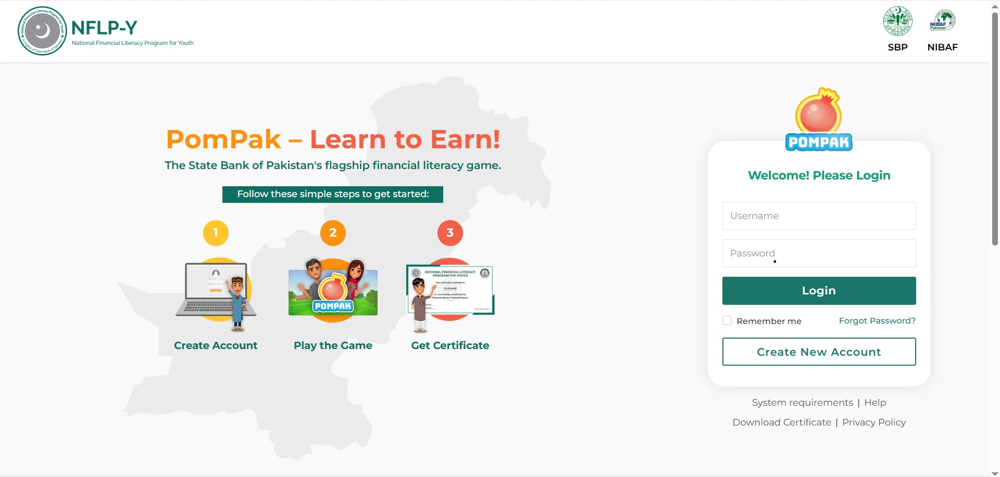
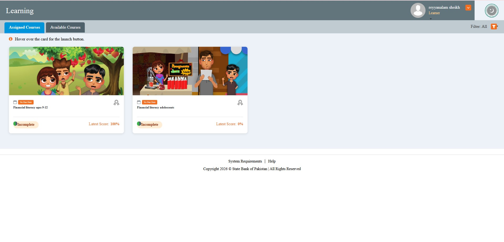
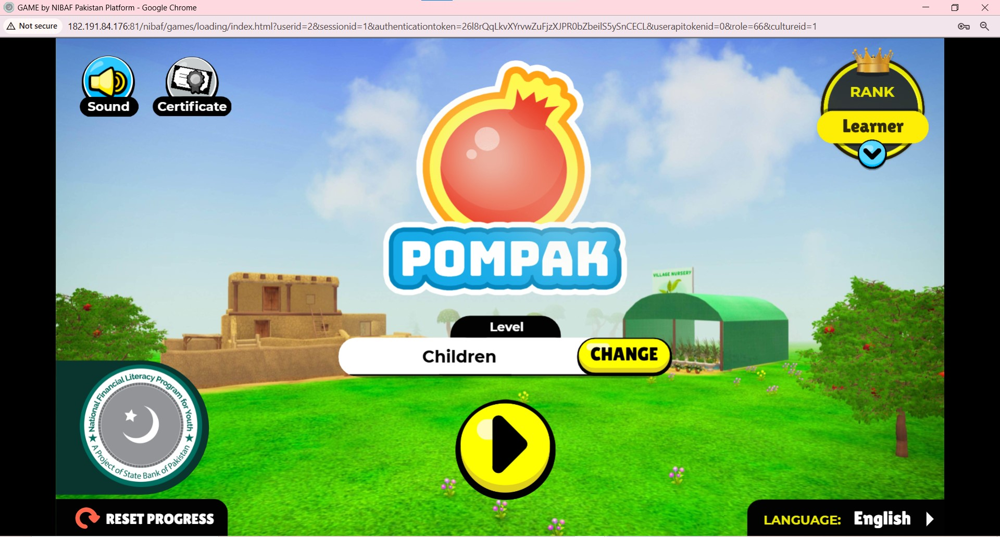

# PomPak – National Financial Literacy Platform

> **Production backend led at Seven Koncepts · Aug 2025 – Dec 2025**

PomPak is a government-backed national financial literacy platform commissioned by the **State Bank of Pakistan** and co-sponsored by **JazzCash**. I led the backend engineering on a platform that scaled to over 1 million registered users, 750,000+ active students, and 45+ districts across Pakistan — one of the largest educational platforms in the country.

🔗 **Live platform:** [nflpy.knowledgeplatform.com](https://nflpy.knowledgeplatform.com)

---

## My Role

**Backend Lead — architecture, database optimisation, containerisation, and cloud deployment**

I led the backend through the critical national rollout phase, solving severe concurrency bottlenecks that were causing exam timeouts during district-wide peak hours. I owned database performance, Docker containerisation, AWS deployment, and CI/CD pipeline maintenance.

---

## What It Does

- **53 bilingual learning modules** (English & Urdu) covering financial literacy topics for students across Pakistan
- **Quiz and exam engine** used simultaneously by thousands of students in 45+ districts during scheduled exam hours
- **Multi-tenant authentication** — district-level isolation with national admin oversight
- **National reporting** — completion tracking, quiz scores, and audit compliance across all districts
- Backed by **State Bank of Pakistan** and **JazzCash** as a national financial education initiative

---

## 📸 Screenshots

<table>
  <tr>
    <td></td>
    <td></td>
  </tr>
  <tr>
    <td></td>
    <td></td>
  </tr>
</table>

---

## Key Problems I Solved

### ⚡ Concurrency Bottleneck — Exam Hour Spikes
The platform faced extreme, unpredictable traffic spikes during school hours when entire districts logged on simultaneously for exams. The existing approach was causing database transaction locks and timeout failures during high-stakes sessions.

**Solution:** Migrated complex grading analytics and multi-table joins out of Laravel's Eloquent ORM into raw **SQL Server Stored Procedures**, reducing query execution time by **85%**. Timeout metrics dropped to zero during examination hours.

### 🐳 Stateless Containerisation for Auto-Scaling
Dockerized the Laravel application to produce stateless API nodes, allowing **AWS EC2 instances to auto-scale horizontally** when CPU load exceeded 70% — handling unpredictable national rollout spikes without manual intervention.

### 🗄️ 53 Multi-Tenant Databases
Managed 53 tenant-isolated databases with shared auth infrastructure — ensuring district-level data separation while maintaining a unified national admin layer and 100% audit compliance.

### 🔄 CI/CD Pipeline & Automated DB Migrations
Maintained CI/CD pipelines and automated database migrations across all environments — safe, repeatable deployments with no downtime during active national exam sessions.

---

## Results

- ✅ **1M+ registered users** served reliably through the national rollout
- ✅ **85% reduction** in query execution time via SQL Server stored procedures
- ✅ **Zero server timeouts** during national examination hours
- ✅ **100% audit compliance** across all 45+ districts
- ✅ Infrastructure costs scaled efficiently — horizontal auto-scaling on AWS EC2

---

## Tech Stack

| Layer | Technology |
|---|---|
| Framework | PHP · Laravel |
| Database | SQL Server (Stored Procedures) |
| Containerisation | Docker & Docker Compose |
| Cloud | AWS EC2 · AWS S3 |
| CI/CD | Automated Pipeline · DB Migrations |
| Auth | Multi-tenant JWT · Role-Based Access |
| Frontend | JavaScript · PHP Blade |

---

## Architecture Overview

```
AWS Load Balancer
  │
  └── Dockerised Laravel (Stateless API Nodes)
        │  Auto-scales on AWS EC2 when CPU > 70%
        │
        ├── SQL Server ─── 53 Tenant DBs (District Isolation)
        │     └── Stored Procedures (Grading Analytics, Multi-table Joins)
        │
        ├── Multi-tenant Auth (JWT · RBAC)
        │
        └── CI/CD Pipeline ─── Automated DB Migrations ─── AWS S3
```

---

## About This Repo

> The source code for PomPak is proprietary and owned by Seven Koncepts / Knowledge Platform. This repository documents my backend contribution, architectural decisions, and the engineering challenges solved — standard practice for professional portfolio showcases.

**Employment certificate from Seven Koncepts available on request.**

---

*Built by [Reyyan Alam](https://github.com/Reyyan31) · Backend Engineer · Node.js & APIs · Cloud & DevOps*
